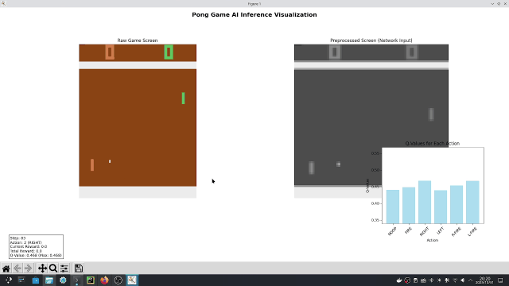

# next_RL

## 演示

*使用DQN算法进行"PongNoFrameskip-v4"游戏的训练结果展示*

## V1.0版本

在V1.0版本中，初步实现了基于Pong游戏的DQN的模型训练、搭建以及推理可视化等

在V1.0版本中，初步实现了基于Pong游戏的PPO的模型训练、搭建以及推理可视化等

在V1.0版本中，初步实现了基于Pong游戏的A3C的模型训练、搭建以及推理可视化等

关于V1.0版本的DQN、PPO与A3C文件夹下的程序的运行，需要以下的配置哦！

*创建独立的python虚拟环境*

    conda create -n next_test_RL python=3.11

*配置pytorch+cuda的环境*

    pip3 install torch torchvision --index-url https://download.pytorch.org/whl/cu126

*配置gymnasium强化学习环境*

    pip install gymnasium==0.28.1
    pip install gym==0.26.2
    pip install AutoROM==0.4.2
    pip install "gymnasium[atari,accept-rom-license]"
    pip install "autorom[accept-rom-license]"
    pip install grpcio==1.76.0
    pip install gym-notices==0.1.0

*配置其它的依赖包*

    pip install Pillow matplotlib
    pip install opencv-python
    pip install imageio
    pip install imageio-ffmpeg
    pip install moviepy
    pip install psutil
    pip install tqdm
    pip install pandas
    pip install requests
    pip install ale-py==0.8.1
    pip install protobuf
    pip install tensorboard

配置成功上述所列的环境与依赖后，即可来到DQN、PPO或A3C文件夹下运行训练或推理程序了

## V1.1版本

在V1.1版本中关于DQN、PPO与A3C的运行环境依然是沿用V1.0版本下的环境配置，若想运行V1.1版本下的这三种算法

的程序文件，就按照上面V1.0版本的环境配置进行配置即可成功运行程序，只是在V1.1版本中这三种算法对应的项目文件结构

有所变化。

